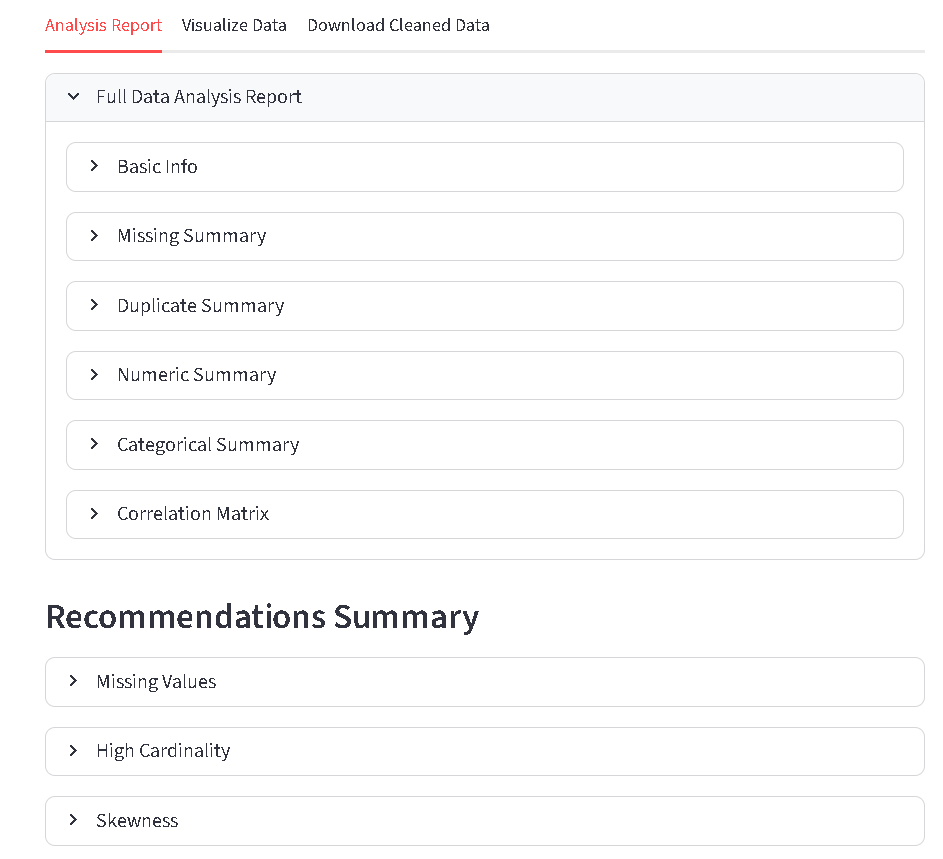
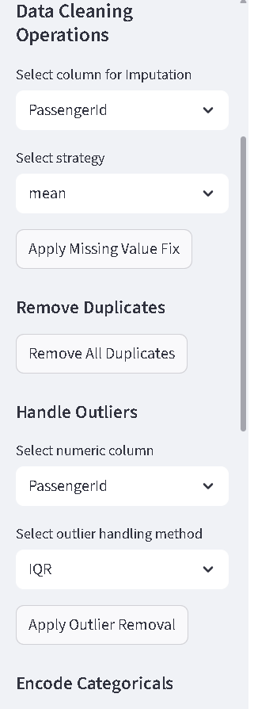
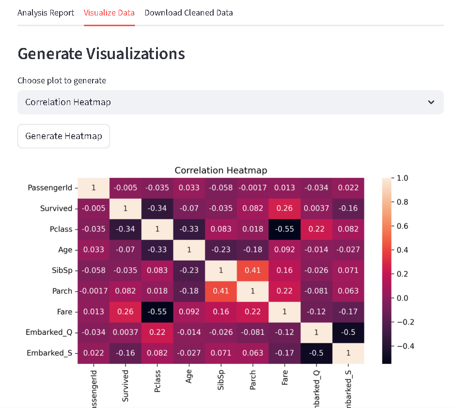

# Data Cleaning Automation Tool

An interactive Streamlit web application that serves as a Data Cleaning Assistant. This tool allows you to upload a dataset, receive a comprehensive analysis report, get AI-like recommendations for cleaning, and perform cleaning operations interactively.

---

## About The Project

Data cleaning is often cited as 80% of a data scientist's work. This project aims to streamline and accelerate that process. Instead of writing repetitive Pandas code for every new dataset, this tool provides a robust UI to perform the most common analysis and cleaning tasks.

This application is built with a modular, Object-Oriented Programming (OOP) approach to ensure the code is reusable, maintainable, and scalable.

### Key Features

* **Comprehensive Analysis:** Upload a CSV or Excel file and instantly generate a full report, including:
    * Dataset shape, dtypes, and memory usage.
    * Missing value counts and percentages.
    * Duplicate row counts.
    * Descriptive statistics for numeric columns (mean, median, skew, kurtosis).
    * Summaries for categorical columns (unique counts, top value).
    * A full correlation matrix.

* **Smart Recommendations:** Based on the analysis, the tool provides a list of actionable suggestions (e.g., "Column 'Age' has 15% missing values, consider median imputation" or "Column 'Salary' is highly skewed, consider log transformation").

* **Interactive Cleaning:** Use the sidebar controls to clean your data step-by-step. The data preview updates in real-time. Operations include:
    * Handling missing values (mean, median, mode, constant, or drop).
    * Removing duplicate rows.
    * Removing outliers (using IQR or Z-score).
    * Encoding categorical columns (One-Hot or Label Encoding).
    * Scaling numeric features (StandardScaler, MinMaxScaler).

* **Dynamic Visualizations:** Generate and view plots on your *cleaned* data from within the app, including:
    * Missing Values Heatmap
    * Correlation Heatmap
    * Value Count Bar Plots
    * Outlier Box Plots
    * Numeric Pair Plots

* **Download Cleaned Data:** Once you are finished, you can download your final processed DataFrame as a new CSV or Excel file with a single click.

---

## Screenshots


**Full Analysis Report & Recommendations**


**Interactive Cleaning Controls**


**Dynamic Visualization Tab**


---

## Tech Stack

* **Backend:** Python
* **Data Manipulation:** Pandas, NumPy
* **Web Framework:** Streamlit
* **Visualization:** Matplotlib, Seaborn
* **ML Preprocessing:** Scikit-learn

---

## Project Structure

The project is built using an Object-Oriented design to separate concerns.

* `app.py`: The main Streamlit application file that handles the UI and state management.
* `core/`:
    * `analyzer.py`: Contains the `DataAnalyzer` class for generating reports.
    * `cleaner.py`: Contains the `DataCleaner` class for all transformation logic and a `BaseValidator` for robust error handling.
    * `visualizer.py`: Contains the `DataVisualizer` class for generating plots.
    * `recommender.py`: Contains the `RecommendationEngine` class for generating suggestions.
    * `utils.py`: Contains helper functions for loading files, displaying reports, etc.

---

## How To Run Locally

1.  **Clone the repository:**
    ```sh
    git clone https://github.com/zeeshan-akram-ds/DataCleaningAutomation.git
    cd DataCleaningAutomation
    ```

2.  **Create and activate a virtual environment:**
    ```sh
    python -m venv venv
    source venv/bin/activate  # On Windows: venv\Scripts\activate
    ```

3.  **Install the required packages:**
    ```sh
    pip install -r requirements.txt
    ```
    ```sh
    pip freeze > requirements.txt
    ```

4.  **Run the Streamlit app:**
    ```sh
    streamlit run app.py
    ```

---

## Future Plans

This is v1.0 of the project. Future plans include:
* More advanced imputation techniques (e.g., KNN).
* Feature transformation (e.g., Log, Box-Cox).
* Saving and exporting the cleaning "pipeline" (e.g., as a scikit-learn pipeline).

---

## Contact

Zeeshan Akram - [github.com/zeeshan-akram-ds](https://github.com/zeeshan-akram-ds)